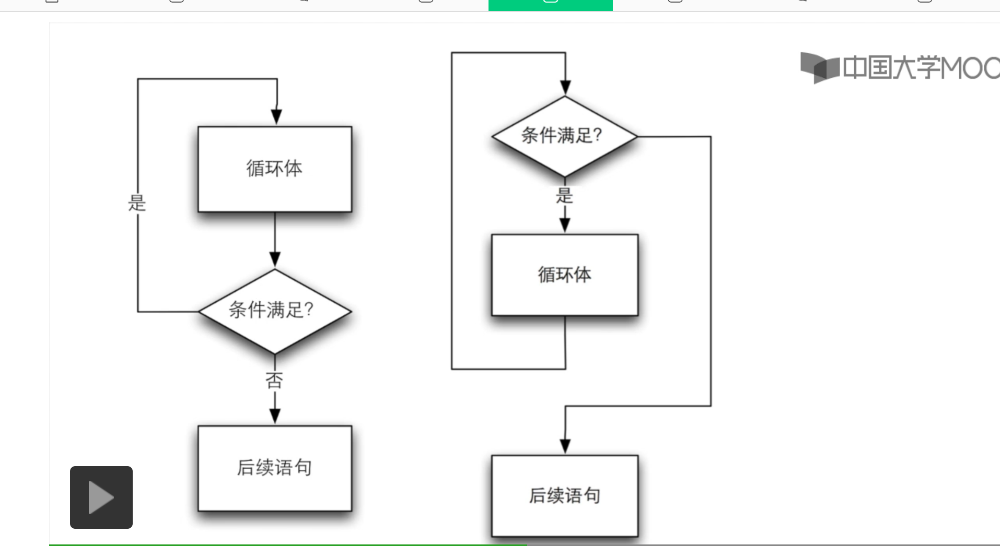
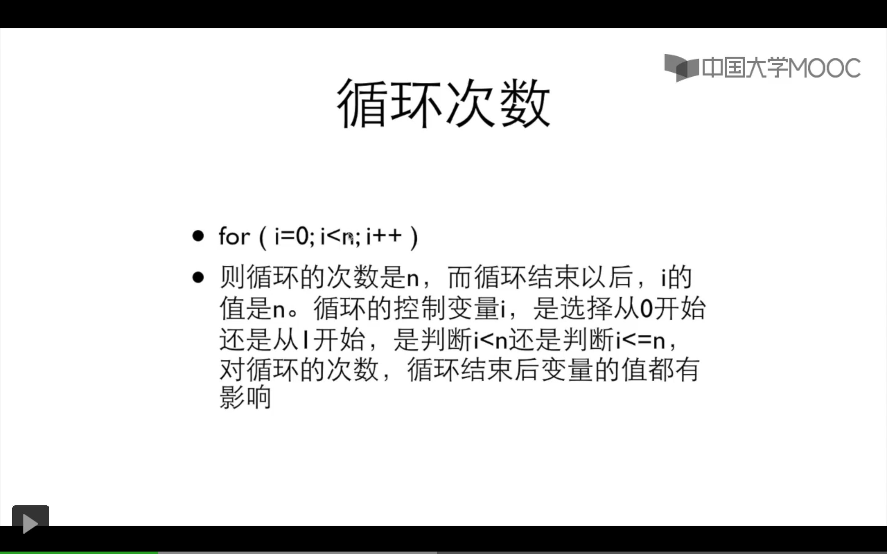
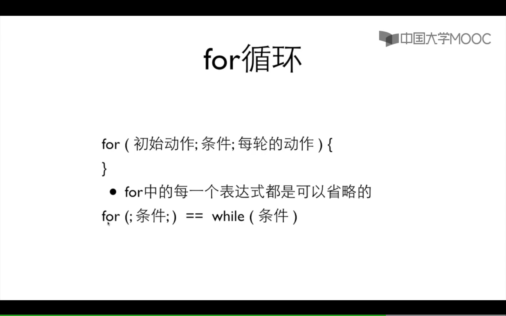

# 循环



## do while 与 while

```cpp
#include<stdio.h>
int main(void)
{
long x=0;
long n=0;

scanf_s("%d",&x);

while (x > 0) {
n++;
x /= 10;
printf("%d %d\n", x, n);
}
printf("您输入的位数是:%d\n", n);
return 0;
}
```

```cpp
#include <stdio.h>
int main(void)
{
int x;
int n=0;

scanf_s("%d", &x);

do {
x /= 10;
n++;
}
while (x > 0);
printf("%d",n);
return 0;
}
```

## for 循环
`For(i=1;i<=n;n++);`

for循环里有三个语句:

第一个语句是 初始条件
第二个语句是 循环继续的条件
第三个语句时 循环每轮要做的动作

 

有固定次数用 for
如果必须执行一次 用 do while
其他情况： while
## 多重循环
```cpp
#include<stdio.h>
int main()
{
int x ;
int cnt = 0;
x = 2;
while (cnt < 51)
{
int i;
int isprime = 1;//是素数
for (i = 2; i < x; i++)
{
if (x % i == 0)
{
isprime = 0;
break;
}
}

if (isprime == 1)
{
printf("%d", x);
cnt++;
}
x++;
}
return 0;
}
```
## 循环应用：分裂整数

```cpp
#include <stdio.h>

int main()
{
    int x;
    scanf("%d", &x);

    int mask = 1;
    int t = x;
    while (t > 9) {
        t /= 10;
        mask *= 10;
    }

    printf("x=%d, mask=%d\n", x, mask);

    do {
        int d = x / mask;
        printf("%d", d);
        if (mask > 9) {
            printf(" ");
        }
        x %= mask;
        mask /= 10;
    } while (mask > 0);

    printf("\n");
    return 0;
}
```
