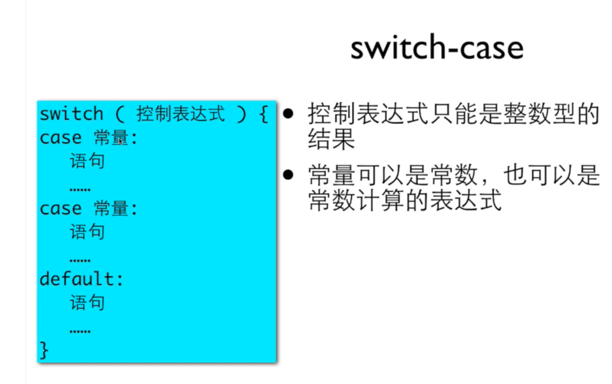

# else if 级联与 switch case

Else if

```cpp
#include<stdio.h>
int main()
{
    int abs, x;
    scanf_s("%d", &x);
    if (x > 0) {
        abs = 1;
    } else if (x == 0) {
        abs = 0;
    } else {
        abs = -1;
    }
    printf("%d", abs);
    return 0;
}
```

使用switch 必须是整数类型

```cpp
Switch(type)
{
Case 1:
语句;
Break;
Case2:
语句;
Break;
……
Default:
语句;
Break;
}
```



**在 switch 中 break 比 case 更重要**
case只是决定从哪里开始的位置
而break决定的是程序的终止

```cpp
scanf("%d", &grade);
grade /= 10;
switch (grade) {
    case 10:
    case 9:
        printf("A\n");
        break;
    case 8:
        printf("B\n");
        break;
    case 7:
        printf("C\n");
        break;
    case 6:
        printf("D\n");
        break;
    default:
        printf("F\n");
        break;
}
```

```cpp
#include<stdio.h>
int main()
{
    char name;
    int score;
    scanf_s("%d", &score);
    score /= 10;
    switch (score) {
        case 10:
        case 9:
            name = 'A';
            break;
        case 8:
            name = 'B';
            break;
        default:
            name = 'F';
            break;
    }
    printf("%c", name);
    return 0;
}
```

单一出口

%c 单一字符
%s 字符串

用switch时 如果一个case里有需要声明则需要括起来

```cpp
switch(n)
{
    case 1:
        printf("I love Luogu!\n");
        break;
    case 2:
        printf("6 4\n");
        break;
    case 3: {
        int num = 14, p = 4;
        int x = num / p;
        printf("%d %d %d\n", x, x * p, num - x * p);
        break;
    }
    case 4: {
        float x = 500.0 / 3;
        printf("%f\n", x);
        break;
    }
    default:
        break;
}
```
