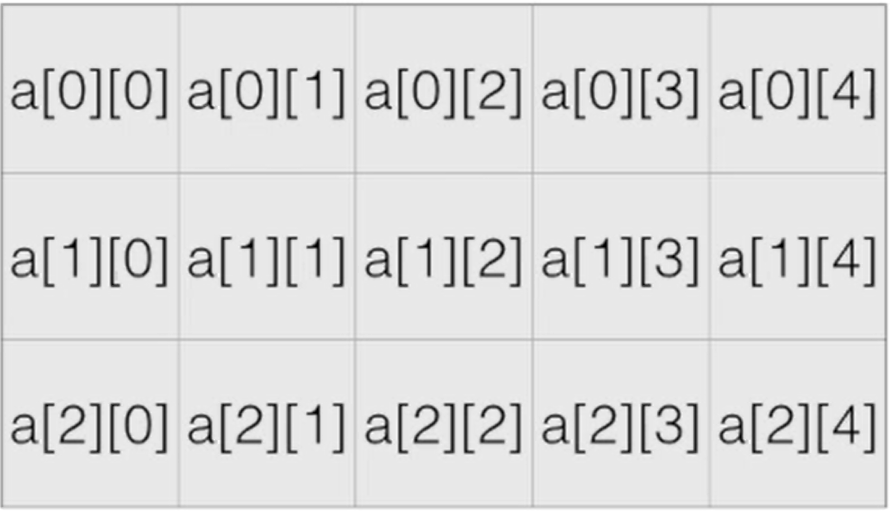
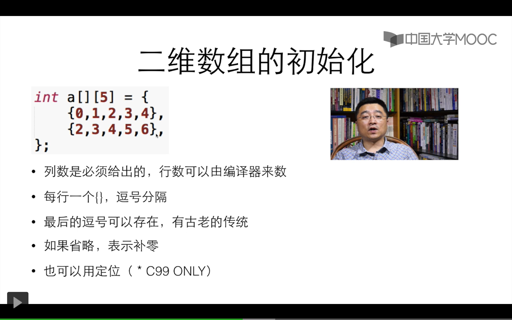
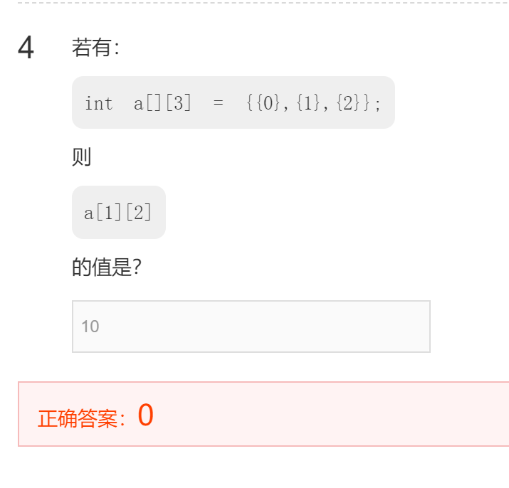

# 数组

类型 名称 [数量]
举例
`Int number[100]`
`Double weight[20]`

注意：数量只能是整数
C99之前元素数量必须是常量
之后版本可以拿变量

数组是一种容器
其中所有的元素具有相同的数据类型
一旦创建，不能改变大小
数组中的元素在内存中是连续依次排列的

一个数组
`Int a [10]`

a[0]-a[9]

可以出现在赋值的左边和右边
a[9]=a[1]+2;
赋值左边的叫左值

长度为0的数组
可以存在
没有用处

C99之后可以拿变量定义元素数量

```cpp
#include<stdio.h>

int main()
{
    int x,i;
    const int number=10;
    int count[number];
    for (i=0;i<number;i++)
    {
        count[i]=0;
    }
    scanf("%d",&x);
    while(x!=-1)
    {
        if (x>=0 && x<=9)
        {
            count[x]++;
        }
        scanf("%d",&x);
    }
    for(i=0; i<number;i++)
        printf("%d:%d\n",i, count[i]);
    return 0;
}
```

二维数组

int a[3][5]
意思是建立一个三行五列的矩阵





```cpp
Int a[]={5,5,5}
//数组a的0、1、2位的数字分别是5、5、5
Int a[3]={6}
//数组a的0、1、2位的数值分别是6、0、0
Int a[6]={[1]=9,9,[4]=7}
//数组a 0 1 2 3 4 5
0 9 9 0 7 0
```

数组的大小
Sizeof

=Sizeof(a)/sizeof(a[0])

数组的赋值
```cpp
Int a[]={1,2,3,4,5,6}
❌Int b[]=a
✔for(i=0,i<sizeof a/sizeof a[0],i++)//遍历数组
{
b[i]=a[i];
}
```

遍历数组常见的错误
1. 循环结束条件 `i <= 数组长度` （注意那个0）
2. 离开循环后继续用i做下标

错题



二维数组是线性排列的可以把所有数据写在一个花括号内
`Int num[3][3]={1，2，3，4，5，6，7，8，9}；`
