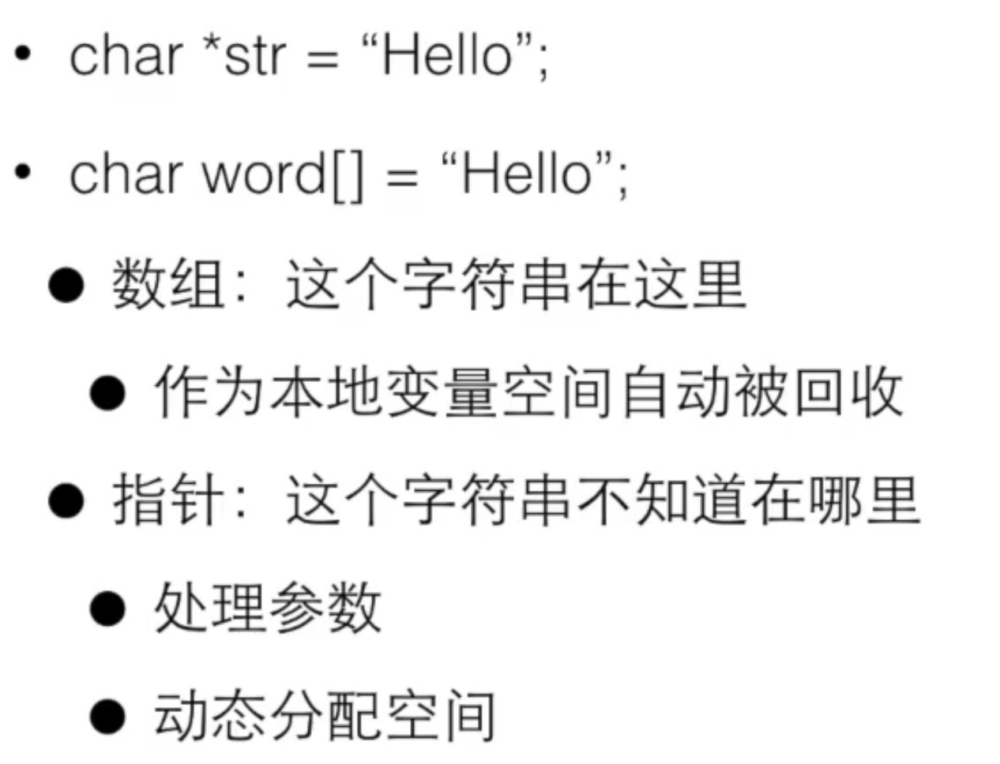

# 字符与字符串

字符数组不是字符串 因为他不能用字符串的方式进行计算
字符串是以'\0'结束的 多占一位
0标志字符串结束但他不是字符串的一部分
字符串以数组的形式存在 以数组、指针访问
两个相邻的字符串之间如果没有符号 系统会把他们合并成一个
字符串是以数组形式存在的
通过数组的方式可以遍历字符串

字符串用指针还是数组？？



构造字符串->用数组
处理字符串->用指针

Scanf("%7s",&x);
s是告诉scanf最多能读入7个数

空字符串
Char string a[100]="";
a[0]=='\0'

```cpp
#include <cstdio>
#include <iostream>
using namespace std;
int main()
{
    char a2[] = {'A', 'B', 'C', '\0'};
    char a3[] = "ABCDEF";
    cout << a2 + 1 << endl;
    printf("%s\n", a3 + 2);
    return 0;
}
```

A2+1 代表从a2[1]开始输出
