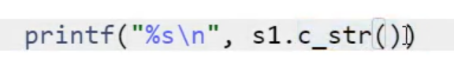
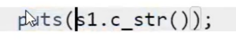
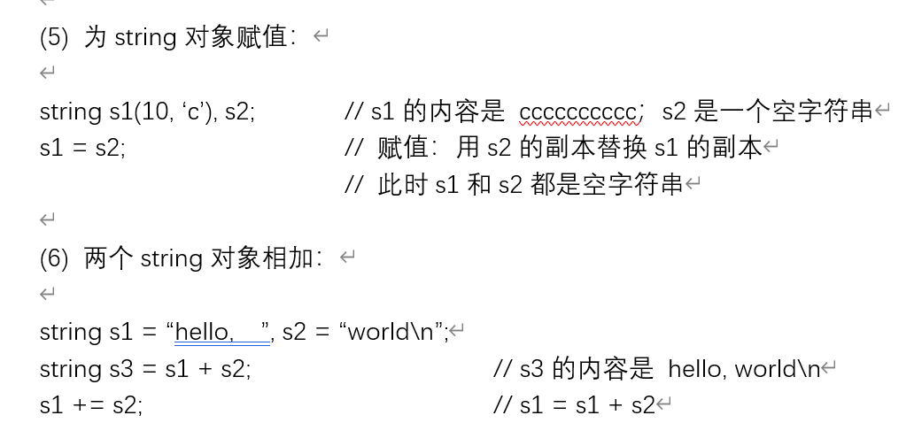

# 字符与字符串输入输出

输入
`Cin` //只适用于无空格
`fgets(数组名, 数量, stdin);` //（字符串） **能把你的回车读入进去** **不安全**
`Getline(cin, 数组名);` //（string类）
`Cin.getline(数组名, 数量);`

`scanf()` 能读入字符串不能读入整数数组 string类不适用

输出
`puts();`
`cout;`

string类的printf




Ps
当scanf读入一个char类型的数据时 不能过滤掉 上一个回车 只能把上一个回车读进来
而cin能过滤掉

```cpp
#include <cstdio>
#include <iostream>
using namespace std;
int main()
{
    char str[31];
    scanf("%s", str);
    char c;
    scanf("\n%c", &c);
    for (int i = 0; str[i]; i++)
        if (str[i] == 'c')
            ;
}
```
```cpp
#include <iostream>
#include <string>
using namespace std;
int main()
{
    string s1;
    string s2 = s1;
    string s3 = "hiya";
    string s4(10, 'c');
    return 0;
}
```

```cpp
#include <cstdio>
#include <cstring>
#include <iostream>
using namespace std;
int main()
{
    string s = "Hello World!";
    for (char c: s) cout << c << endl;
    return 0;
}
```

这里的c是从s[i]复制过来的
要想改变s里面的值
就要在for中把c变为&c
这时c就是s[i];

`.empty` 检验是否为空字符串 如果是则返回0 不是则返回1
`.size` 和strlen效果一样
`.back()` 是字符串最后一个位置
`.pop_back()` 删掉最后一个字符
`.substr(i,len)` 返回从i开始 长度为len的字符 省略len就直接到最后停止 **用于插入**

string类型的两个字符串、字符 可以任意相加累加 相当于拼接
但是+的两侧必须至少有一个string类型的字符串
 ```cpp
for(int i=0;i<a.size();i++)
{
    a=a.substr(1)+a[0];
}
```

(用于把字符串移位 第一个移到最后一个)

Srting[100]字符串数组
 ```cpp
#include <bits/stdc++.h>
using namespace std;
int main()
{
    int n;
    cin>>n;
    while(n--)
    {
        char abs;
        int cnt=0;
        string str;
        cin>>str;
        for(int i=0;i<str.size();i++)
        {
            int j=i;
            while(j<str.size() && str[j]==str[i]) j++;
            if(j-i>cnt) cnt=j-i,abs=str[i];
            i=j-1;
        }
        cout<<abs<<' '<<cnt<<endl;
    }
    return 0;
}
```

连续最长出现的字符 #remember-for-later
 ```cpp
#include<bits/stdc++.h>
#include<sstream>
using namespace std;
int main()
{
    string s;
    char bb[1000];
    getline(cin,s);
    stringstream ssin(s);
    int a,b;
    string str;
    double c;
    ssin>>a>>b>>str>>c;
    cout<<a<<endl<<b<<endl<<str<<endl<<c;
    sscanf(bb, "%d%d%s%lf",&a,&b,str,&c);
    printf("%d\n%d\n%s\n%f",a,b,str,c);
    return 0;
}
```

![[字符输入输出 - Ink.svg]]
