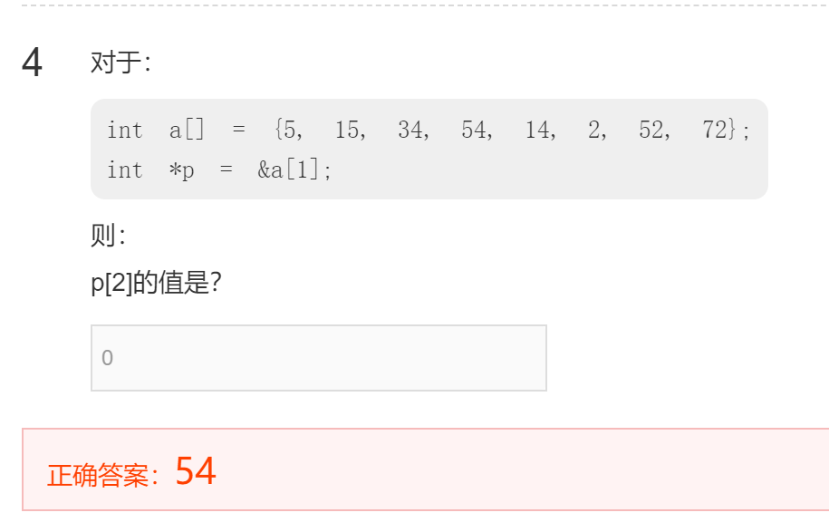

# 指针

数组名只是一个地址
指针是一个左值

`Int *p[9]` pointer array; it is a array every element store a pointer variate
`Int (*p)[9]` array pointer;

数组实际上就是指针
Sizeof(a)==sizeof(int*)

数组参数
函数原型四种是等价的
```cpp
Int sum(int *ar,int n);
Int sum(int *,int);
Int sum(int ar[],int n);
Int sum(int [],int);
```
函数原型可以省略参数名

函数定义（不可省略参数名）
```cpp
Int sum(int *ar,int n)
Int sum(int ar[],int n)
```

数组名就是数组第一个元素的指针地址
`Int a[0]=1000;`
那么`%d=*a=1000`

数组变量本身表达地址 不需要&
`Int a[10]；int*p=a；`
但是数组元素是变量 需要用&
`a=*a[0];`

[]and*都既可以对指针做也可以对数组

数组变量是const常量指针
所以不能对数组赋值
`Int a[]<=>int *const a`



```cpp
#include<stdio.h>

int main()
{
    int num = 5;
    int *p = &num;
    int **r = &p;
    printf(" p=%p\n", p);
    printf(" *p=%d\n", *p);
    printf(" *r=%p\n", *r);
    printf(" **r=%d\n", **r);
    return 0;
}
```

指向指针的指针

```cpp
#include <stdio.h>
int main()
{
    int array[][4] = {
        {4, 5, 6, 7},
        {8, 9, 10, 11}};
    int (*p)[4] = array;
    int i, j;
    for (i = 0; i < 2; i++)
    {
        for (j = 0; j < 4; j++)
        {
            printf("%2d ", *(*(p+i)+j));
        }
        printf("\n");
    }
    return 0;
}
```
## 引用

指针数组与多维数组

两个指针相减=之间的元素个数+1；

```cpp
#include<bits/stdc++.h>
using namespace std;
int main()
{
    int a = 10;
    int &b = a;
    int *c = &a;
    cout << "a = " << a << endl;
    cout << "b = " << b << endl;
    cout << "c = " << *c << endl;
    b += 5;
    cout << "(b+=5)a = " << a << endl;
    cout << "(b+=5)b = " << b << endl;
    cout << "(b+=5)c = " << *c << endl;
    *c += 5;
    cout << "(*c+=5)a = " << a << endl;
    cout << "(*c+=5)b = " << b << endl;
    cout << "(*c+=5)c = " << *c << endl;
    return 0;
}
```
