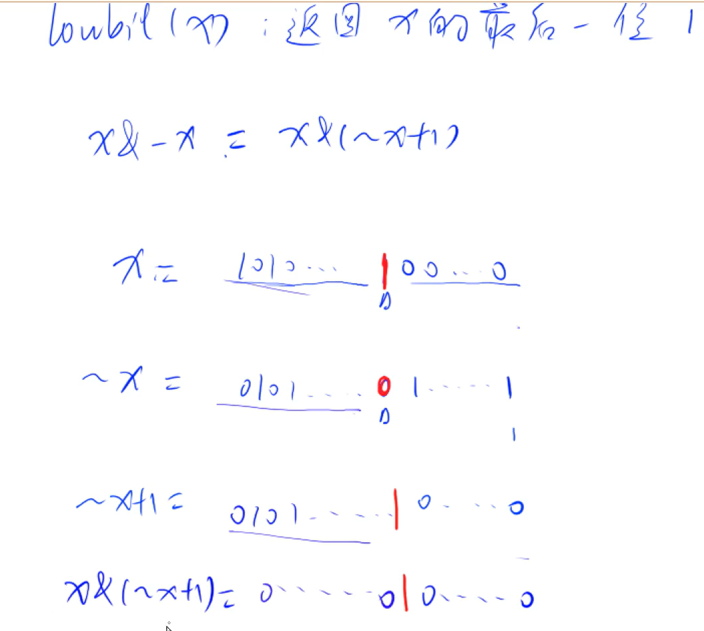

# 位运算

`&` 与
有一个0即为0

`|` 或
有一个1即为1

`~` 非
`~1=0` `~0=1`

`^` 异或
两个数一样为0 两个数不一样为1
`>>` 右移
`<<` 左移

原码 `x`
反码 `~x`
补码 `~x+1`

## 常用操作

### 求 x 二进制的从右数的第 k 位数字：`x>>k-1&1`
例如 我要求十进制数18的二进制数的最后一个数是多少
那么我就要写 `18>>0&1;`

### `Lowbit(x)=x&-x;` 返回 x 的最后一位 1
下面的1010 10 101000 1000均为二进制数
`lowbit(1010)=10;`
`lowbit(101000)=1000;`
`-x=~x+1`

